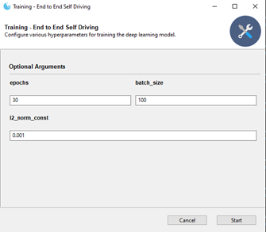
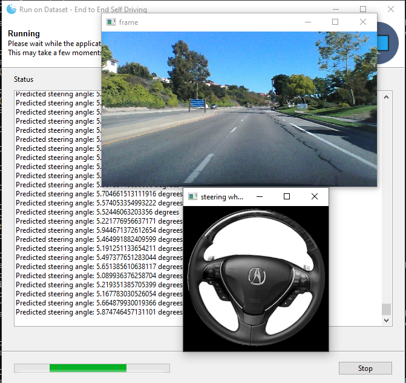
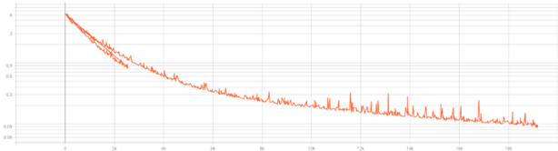

# End-to-end Learning for Self-driving Cars
A TensorFlow implementation of paper titled ["end-to-end learning for self-driving cars"](https://arxiv.org/pdf/1604.07316.pdf) 
[1] with some changes. Built on top of another [open source project by Sully Chen](https://github.com/SullyChen/Autopilot-TensorFlow).

## Requirements
- TensorFlow (1.x or 2.x)/TensorFlow GPU (1.x or 2.x)
- OpenCV
- NumPy
- Gooey

## Directory Structure
````
o
|-- driving_dataset
|   |-- images # default folder for training images.
|   |-- videos # default folder for test videos.
|   |-- data.txt # contains image names and corresponding steering angles. 
|   |-- logs # contains logs for tensorboard.
|   |-- save # contains model checkpoints.
|   |-- assets # contains assets used in README and GUI
|-- model.py # code for CNN model. 
|-- run.py # script to test the model on the real-time video feed.
|-- run_dataset.py # script to test the model on images in the driving_dataset/images folder.
|-- run_video # script to run the model on a video.
|-- train.py # script to train the model.
````

## How to Use
### Training
`python train.py`


### Testing on Live Video Stream
`python run.py`

### Testing on Dataset
`python run_dataset.py`


### Testing on Video
`python run_video.py`
### Run Tensorboard 
Tensorboard can be used to visualize model and plot the loss chart.
1. Run: `tensorboard --logdir=./logs`
2. Open http://localhost:6006/ in browser.

## Data
Dataset videos were recorded by driving around Rancho Palos Verdes and San Pendro 
California. Dataset size is 3.1 GB and it contains 63,000 images, sampled from the videos with a 
frame rate of 20 frames/second. It can be downloaded from [here](https://github.com/SullyChen/driving-datasets).

## Results
Loss values during the training process can be visualized using tensorboard. Loss here is the mean square error (MSE) 
between the steering angle predicted by the CNN model and the one in dataset. Chart below shows that after 30 epochs, 
the MSE reduced from 6.1 to 0.09.


Trained steering model, when tested on the dataset, runs pretty smoothly.

## Future Work
### Reducing Loss
#### 1. Data Augmentation
For increased generalization on unseen data, data augmentation techniques can be applied to 
simulate different light and weather conditions. Furthermore, GANs can be used to change the 
environmental conditions without introducing any changes to the symmetry of the road.

#### 2. Better Architecture
**Deeper Network:**
One obvious next step is to use deeper network to reduce the MSE. 

**Using Two-stream CNNs along with LSTMs/Transformers:**
Current CNN model only captures the spatial features from individual frames. 
One promising direction is to introduce changes to the model to capture temporal features. For instance, we can use 
two-stream CNNs [2] followed by a fully connected layer, further followed by some LSTM layers and finally a 
fully-connected layer. One CNN model can be fed t<sup>th</sup> frame and the other CNN model can be fed t+1<sup>th</sup> 
frame. Using two CNN models in parallel will capture the local-temporal features (somewhat similar to the optical flow) 
and the following LSTM layers will capture the global-temporal features. This approach will especially help with navigating 
through moving entities on the road, such as 
cars and humans.

## References
[1] Bojarski, M., Del Testa, D., Dworakowski, D., Firner, B., Flepp, B., Goyal, P., ... & Zieba, K. 
(2016). End to end learning for self-driving cars. arXiv preprint arXiv:1604.07316.

[2] Weng, X., & Kitani, K. (2019). Learning spatio-temporal features with two-stream deep 3d 
cnns for lipreading. arXiv preprint arXiv:1905.02540.
